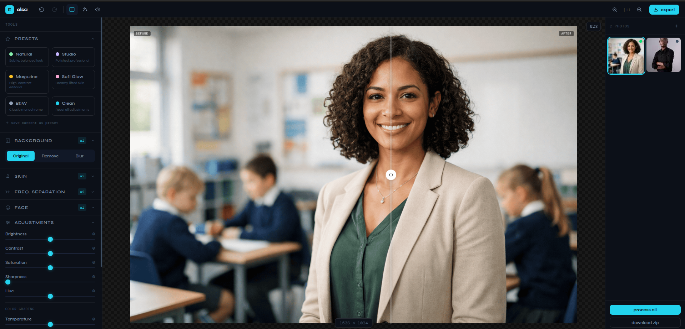

# elsa

A browser-based AI portrait photo editor. All processing runs client-side with no uploads, no server and no subscription required.



## Features

**Background Remove / Blur:** MediaPipe selfie multiclass segmentation isolates the subject with sharp edges for transparent backgrounds or bokeh-style blur.

**Skin Retouching:** Bilateral-filter approximation smooths skin while preserving edges and texture.

**Frequency Separation:** Industry-standard technique that smooths skin tone and color while keeping pores and fine texture intact, applied only to detected skin areas.

**Face Enhancement:** Brighten faces, boost eye contrast, and whiten teeth using landmark-based masks.

**Color Grading:** Temperature, tint, shadows, midtones, and highlights controls all processed in a single Web Worker pass.

**Manual Adjustments:** Brightness, contrast, saturation, hue, and sharpness sliders.

**Presets:** Six built-in looks (Natural, Studio, Magazine, Soft Glow, B&W, Clean) plus the ability to save your own custom presets.

**Auto-Enhance:** One-click smart settings based on image luminance, skin ratio, and saturation analysis.

**Before / After:** Draggable split-view compare slider to see original vs edited side by side.

**Batch Processing:** Upload multiple images, apply settings, process all, and download as a ZIP.

**Undo / Redo:** Full settings history per image.

**Privacy First:** Everything runs in your browser. Images never leave your device.

## Tech Stack

- [Next.js 16](https://nextjs.org) (App Router + Turbopack)
- [MediaPipe Tasks Vision](https://ai.google.dev/edge/mediapipe/solutions/vision/image_segmenter) for background segmentation
- [face-api](https://github.com/vladmandic/face-api) for face landmark detection
- [TensorFlow.js](https://www.tensorflow.org/js) for AI inference backend
- [Zustand](https://zustand.docs.pmnd.rs) for state management
- [Tailwind CSS v4](https://tailwindcss.com) for styling
- Web Workers for off-main-thread pixel processing
- [JSZip](https://stuk.github.io/jszip/) for batch export

## Getting Started

```bash
git clone https://github.com/aayodejii/elsa.git
cd elsa
npm install
node scripts/downloadModels.js
npm run dev
```

Open [http://localhost:3000](http://localhost:3000) and drop a portrait photo to start editing.

> `node scripts/downloadModels.js` downloads face detection weights and the MediaPipe segmentation model into `public/models/`. This is a one-time step of about 3MB.

## How It Works

1. **Upload:** Drop images onto the canvas. Each is stored as an `ImageBitmap` that is never mutated.
2. **Edit:** Adjust sliders in the sidebar. Settings changes are debounced and re-run the processing pipeline from the original bitmap.
3. **AI Pipeline:** Background segmentation, face detection, and skin masks are cached per image. Only the first run loads models; subsequent slider changes reuse cached results.
4. **Export:** Download the active image or batch-export all as a ZIP.

## Deploy

```bash
npm run build
npm start
```

## Contributing

Contributions are welcome. See [CONTRIBUTING.md](CONTRIBUTING.md) for guidelines.

## License

AGPL-3.0
